# ResidualMap, iteration 3 work journal

Date: 21 September 2026. Repo: github.com/devanshsanghavi-droid/ConradChallenge (branch `main`, commits `c599229` to `30564ab`). Written for whoever picks the code up next, including a coding agent: plain words, every number from `outputs/`, every figure linked.

## What the project is

A small water utility takes a handful of chlorine grab samples a month. ResidualMap turns them, plus the EPANET model the utility already has, into a chlorine map of every junction with an honest error band, a probability that each junction drops below the 0.2 mg/L minimum at any hour of the day, and a suggested route for next month's samples. Software only. It is an entry in the Conrad Challenge 2026-27 Water Challenge.

The core model is a calibrated simulator: the operator's EPANET model is run over a grid of unknown decay and hydraulic parameters, the grid members are weighted by how well they explain the samples, and a Gaussian process learns whatever is left over. Iteration 2 had this working for a single hour of the day (14:00). Iteration 3, this journal, made it time-aware, fixed its error bars, stress-tested it, gave it a route planner, ran it on two more networks, wrapped it in an app, and wrote the path to real data.

## Day 0, setup

- The folder was not a git repo. The real project was inside `residualmap.zip` with its own one-commit history. I merged that history in, dropped the loose duplicate files, and pushed to GitHub.
- No Python environment had `wntr` (the EPANET wrapper). I made a `.venv` from the anaconda Python 3.13 and installed `requirements.txt`. Everything runs with `.venv/bin/python`.
- The 2-seed sanity run reproduced the committed iteration-2 numbers exactly (to 4 decimals) for every deterministic model. Only the PINN and the 23-feature GPs drift between numpy versions. One pre-existing bug fixed: the final print-out asked for a column `cov` that is called `cov90`.
- This machine is fast: the full 8-seed Net3 experiment takes about 3 minutes, not the 5 in the old README, and the 675-run EPANET grid takes 20 seconds.

## The finding that drives everything

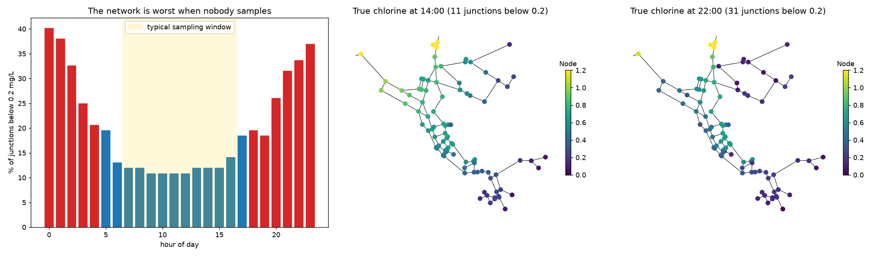

In scenario 0 on Net3, 11 of 92 junctions are below 0.2 mg/L at 14:00, 31 at 22:00, and 40% at midnight. Operators sample by day. Iteration 3 exists to predict the night from daytime samples.

## Task 1, time-aware model

**Asked:** predict the full 24-hour profile and the daily minimum from daytime samples only, with sampling restricted to 07:00 to 17:00. Acceptance: recall of junctions whose daily minimum is below 0.2 mg/L at or above 0.80 with 15 daytime samples.

**Built:**
- `simgp.simulator_grid_24h`: the simulator grid now keeps all 24 hours of every EPANET run (they were already computed, only the 14:00 slice was stored). `simulator_grid` slices its hour from the same cache, so the old model is unchanged.
- `simgp.SimGP24`: samples are (junction, hour, mg/L). Each grid member is scored on its simulated value at each sample's own hour. The discrepancy GP takes the water age at that hour, the hydraulic embedding, the wall-exposure index, distance to source, and sin/cos of the hour. The daily minimum and P(daily min < 0.2) come from Monte Carlo draws: pick a grid member by its weight, add a joint 24-hour GP draw per junction, take the minimum.
- `surrogate.acquire_time`: four rules for picking the next (junction, hour) pair inside the daytime window: random, max-uncertainty, hourly straddle, and `straddle_min` (straddle on the daily minimum picks the junction, the daytime hour with the widest reducible band picks the hour).
- `experiment.run_scenario_time` plus two figures and a new results file.

**Found:** the hourly straddle rule samples junctions near 0.2 mg/L, and those are exactly the "front" junctions where the operator's model is structurally wrong (truth 3 times higher than any grid member). Under a Gaussian likelihood four such readings dragged the calibration to a bulk decay of 0.1 and recall fell from 0.88 to 0.62 as samples were added. A Student-t likelihood (3 degrees of freedom) fixed it: at 15 samples on the straddle loop, RMSE 0.11 instead of 0.19, precision 0.85 instead of 0.64.

**Numbers (Net3, 8 seeds, daytime samples only, scored on unsampled junctions, target = daily minimum):** `straddle_min` recall 0.86 (n=3), 0.94 (n=8), 0.93 (n=15), precision 0.94 at n=15. The iteration-2 model treating every sample as a 14:00 sample: 0.37, 0.27, 0.38. The mean of the samples: 0. **Acceptance met.** Coverage of the daily minimum was poor, 0.81 falling to 0.65, which became task 2.

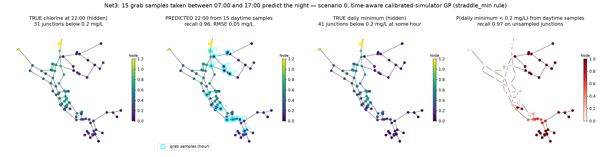

## Task 2, close the calibration gap

**Asked:** add demand and roughness axes to the grid, report a reliability diagram, get the 90% band's coverage into 0.88 to 0.95 with RMSE within 10%.

**Built and found, in the order the diagnosis went:**
1. Demand x{0.85, 1, 1.15} and roughness x{0.9, 1, 1.1} axes: 675 EPANET runs, cached. Coverage 0.76 to 0.87. Not enough.
2. The likelihood scale was 0.25 in ln C. The measured day-time mismatch between the truth and the best grid member is 0.33, so the scale is the model error, not the grab-sample noise. Set to 0.35. Scanning 0.30 to 0.50 moves coverage smoothly with RMSE and recall flat, so it is not a lucky spot. Marginalising the scale over a list was tried and rejected: the tightest scale wins whenever a few samples fit one member, which makes the posterior more concentrated, not less.
3. Source dose was not on the grid. In seed 2 the junctions next to the source sat at 1.28 mg/L all day (the truth's dose was 7% high) while every member said 1.19 with a 0.1 mg/L band. Since first-order decay is linear in concentration, a dose axis is an exact offset in log space and costs no EPANET runs. Added x{0.90 to 1.10}.
4. Calibrating the global demand and roughness multipliers does not remove the operator's local per-node and per-pipe errors of the same size. The grid's own spread along the hydraulic axes at each (hour, junction) is now carried into the band as the variance of that local error (`local_hydraulic_var`). In the daily-minimum Monte Carlo it enters as the whole-day deviation of a random hydraulic sibling of the drawn member.
5. The time-aware GP's hour length-scales often sat at the lower bound, about 15 minutes. That made the joint 24-hour draws white noise, and the minimum of 24 noisy values is biased low by about 2 standard deviations, so flat high-chlorine junctions sat above the band. A discrepancy driven by the diurnal demand pattern cannot change in 15 minutes; the hour inputs now have a floor of about 3 hours. Age-scaled discrepancy was tried and rejected: mean water age on Net3 is 15.1 h at 02:00 and 16.4 h at 14:00, the night mismatch is tank timing, not age.
6. Student-t became the default for the snapshot model too, and acquisition rules now use only the reducible part of the uncertainty (parameter spread plus GP), because the local hydraulic term never shrinks when you sample.

**Numbers (Net3, 8 seeds, random samples):** 90% coverage over n = 3 to 15 went from 0.756 to **0.947**; at the 50/80/95% levels from 0.45/0.67/0.81 to 0.68/0.90/0.97. RMSE 0.136/0.122/0.089 to 0.122/0.107/0.085. Daily minimum coverage 0.65 to 0.93 (random) and 0.88 (straddle_min); daily-minimum recall 0.99 at n=15. **Acceptance met.**

**Regressions, recorded not hidden:** the max-uncertainty rule lost 20% recall (0.90 to 0.70 at n=15) and is marked not-for-use in the README. Snapshot recall under random samples is about 5% lower on average, in exchange for 10 to 16 points more precision and a higher F1. The 50% band over-covers (0.68). Daily-minimum coverage still narrows with n (0.96 to 0.87).

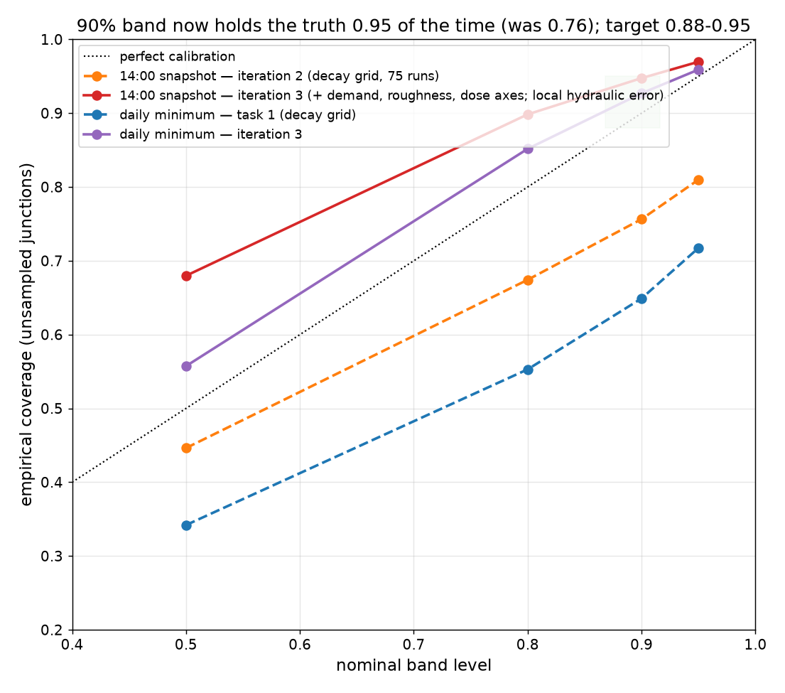

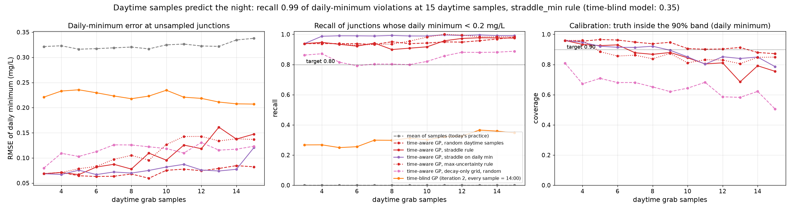

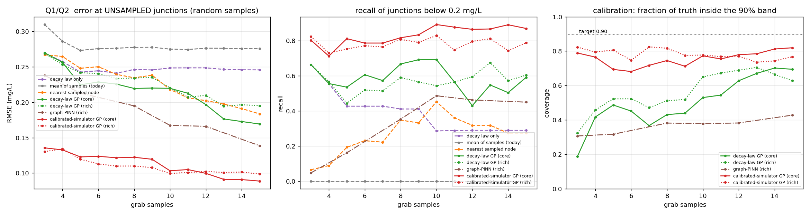

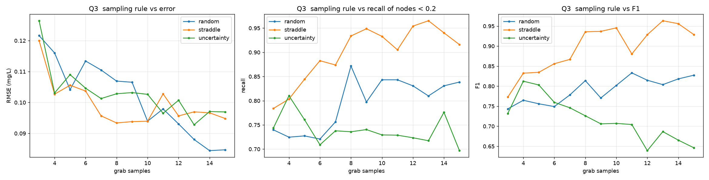

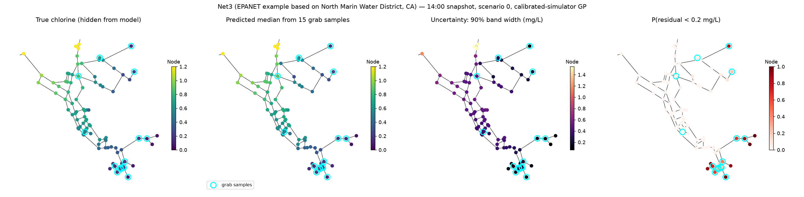

## Task 3, structural mismatch stress test

**Asked:** with probability 0.5 close one random non-bridge pipe and multiply one random tank's initial level by 0.7, in the truth only. Report how much the model degrades and whether the discrepancy GP absorbs it; propose a fix if recall falls below 0.7 at n=15.

**Built:** `simulate.apply_structural_noise` and `closable_pipes` (a pipe is closable if it is not a bridge of the link graph, or has a parallel link; connectivity is re-checked with networkx after removal). CLI `--structural` and `--structural=persistent`. A `simgp_core_nogp` row (the calibrated simulator alone) so "does the GP absorb it" has a number.

**Found:** the tank initial-level change is a no-op on the scored day. The truth is a 7-day run scored on day 7, and a tank forgets its initial level by then: the scored day changes by less than 0.05 mg/L, no junction changes category, in all 8 seeds. Only the closed pipe bites, and the coin gave it to 2 of 8 seeds. I kept the spec'd option as-is and added a `persistent` variant (tank diameter x0.7, half the volume the file says) that moves the truth by 0.5 to 0.8 mg/L at 26 to 77 junctions in every seed.

**Numbers (persistent variant, file correct to file wrong):** snapshot straddle recall at n=15 0.92 to 0.92, random 0.84 to 0.80, coverage 0.95 to 0.94. Daily minimum recall 0.99 to 1.00, coverage 0.88 to 0.88. Recall stays above 0.7 in every configuration, no fix required. The GP is worth about +5 recall and +11 coverage points at 15 samples, wrong file or not; most of the robustness comes from the hydraulic axes and the local error term in the band.

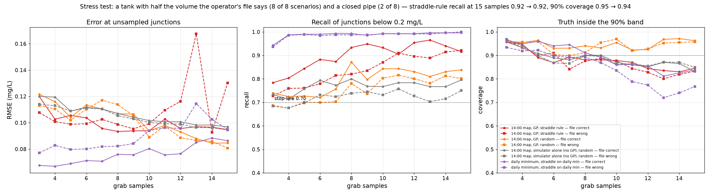

## Task 4, route optimiser

**Asked:** choose K (junction, hour) pairs at once, greedy on the straddle score with a diversity penalty in hydraulic-distance space. Compare with K random sites and K highest-demand sites for K = 5, 8, 12 over 8 seeds. Acceptance: the optimised route wins on recall of daily-minimum violations at every K.

**Built:** `route.py` with `plan_route` (planned from the `.inp` alone, before any sample, via `SimGP24.fit_prior`), `random_route`, `demand_route`. At most ceil(K/11) sites per daytime hour so one person can drive it. A one-sentence reason per site. The repulsion strength was set by a spatial statistic, not by recall: with repulsion 1.0 and a length scale of 5% of the network's hydraulic diameter, the optimised route has the same nearest-neighbour spacing as a random route.

**Numbers (Net3, 8 scenario-months, night violations missed at unsampled junctions, summed over the months, optimised / highest-demand / random):** K=5: 1 / 9 / 3. K=8: 3 / 10 / 8. K=12: 6 / 8 / 6. Recall 0.997/0.972/0.989, 0.989/0.968/0.973, 0.972/0.974/0.980. F1 highest for the optimised route at every K.

**Acceptance met at K=5 and K=8, a tie at K=12.** Six of the eight scenarios are recalled perfectly by every route at every K: after task 2 the daily-minimum classification is nearly saturated on Net3 with any 5 daytime samples. The straddle-chosen sites are the borderline, least-well-modelled junctions, so the route buys flags with some map accuracy (coverage 0.82 to 0.87 against 0.89 to 0.98 for the highest-demand sites).

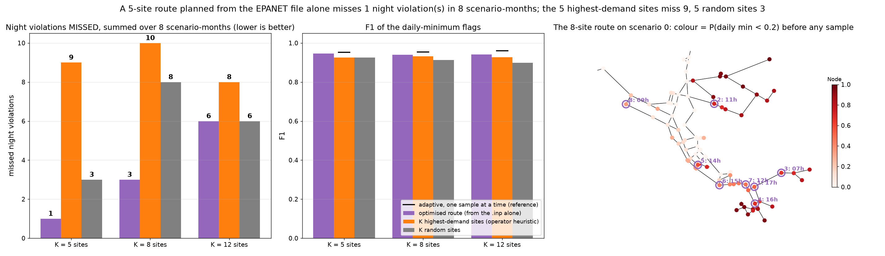

## Task 5, Net2 and ky4

**Asked:** run everything on Net2 (35 junctions, tank-fed) and ky4 (959 junctions). Produce the same figures. Sub-sample the grid or fit an emulator if ky4 is too slow.

**Built:**
- `simulate.source_nodes`: reservoirs, else junctions with a negative demand (a pumped inflow, which is how Net2's water enters), else tanks. A CONCEN source at a tank does nothing in EPANET; at Net2's inflow junction it gives a normal chlorine field.
- Per-network hidden truth (`experiment.NET_TRUTH`): Net2's water is 95 hours old at midday, so with Net3's decay it is 83% below 0.2 mg/L at its daily minimum at any dose. Its truth uses low-demand water (kb 0.10, kw 0.20). ky4 uses a 2.0 mg/L dose. The grid cache name carries the dose.
- Parallel EPANET grid (`ProcessPoolExecutor`, a temp-file prefix per run): ky4's 675 runs in 15 minutes on 11 cores, 62 MB at float32. No sub-sampling needed.
- The daily-minimum Monte Carlo builds per-junction 24x24 covariance blocks directly from the fitted kernel instead of the full 23,000 x 23,000 matrix (4 GB). Verified identical to sklearn's full matrix on Net3.
- The iteration-1 decay-law baseline's median is clipped to 10 mg/L (it extrapolated to 2847 mg/L at 3 samples on Net2).

**Numbers:**

| network | 14:00 RMSE n=3/8/15 | 90% coverage | daily-min recall (straddle rule) n=3/8/15 | daily-min coverage | time-blind recall |
|---|---|---|---|---|---|
| Net3, 8 seeds | 0.12 / 0.11 / 0.09 | 0.95 | 0.94 / 0.99 / 0.99 | 0.88 | 0.27 to 0.35 |
| Net2, 8 seeds | 0.09 / 0.08 / 0.09 | 0.97 | 0.92 / 0.86 / 0.85 | 0.90 | 0.10 to 0.17 |
| ky4, 2 seeds | 0.08 / 0.09 / 0.11 | 0.96 | 0.89 / 0.95 / 0.98 | 0.91 | 0.42 to 0.63 |

Net2 has a story of its own: only 0 to 5 junctions are low at 14:00 but 20 of 35 dip below 0.2 at some hour, worst at 04:00 to 08:00 and at 18:00. ky4 is low all day (19 to 25% of junctions at every hour); 15 daytime samples still find 98% of the 353 junctions whose daily minimum is below 0.2.

**Two findings that did not transfer:** on ky4 the discrepancy GP hurts the map at 15 samples (RMSE 0.11 with it, 0.08 without; the straddle rule reaches 0.21). Winsorising residuals changes nothing, so it is not outliers: fifteen points cannot support a discrepancy field over 959 junctions in an 8-dimensional feature space. Proposed rule: GP on only when n is at least J/25, or by marginal likelihood. And the route optimiser's edge is Net3-specific: on Net2 and ky4 the highest-demand sites do as well or better, and straddle-chosen sites hurt calibration at K=12. Proposed: a mixed route, half the sites for the violation call, half to calibrate.

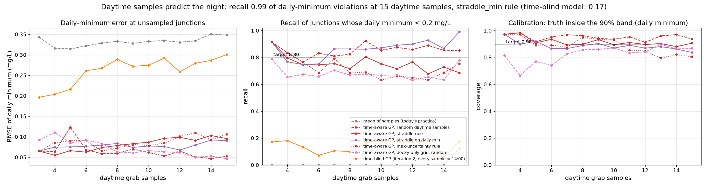

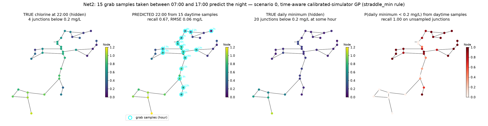

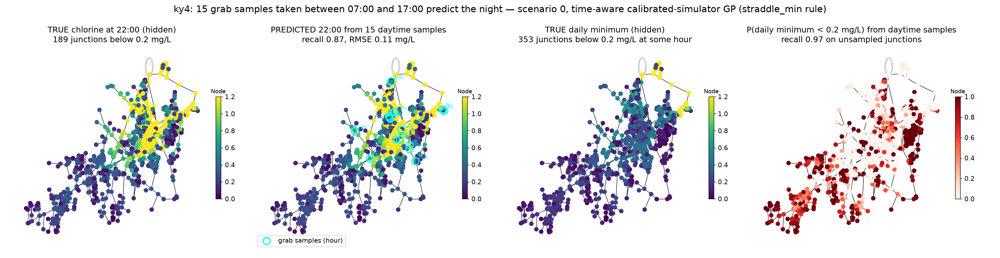

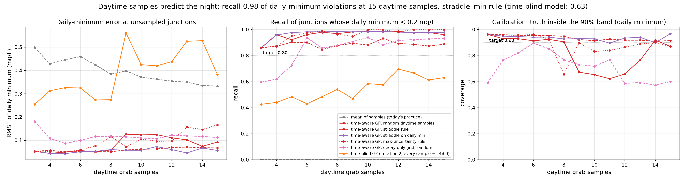

## Task 6, the app

**Built:** `app.py`, one Streamlit file. Pick an example network or upload an `.inp`, set the plant dose and the minimum residual, type grab samples as rows (junction from a dropdown of the model's own IDs, hour, mg/L). Four panels: chlorine map with the samples marked, 90% band width, P(residual < limit), and next month's route on the map. A table of the route sites with a reason each, the worst-hour bar chart, headline metrics, and a one-page PDF made with matplotlib's own PDF backend (no new dependency). The view switches between the daily minimum and any hour. With no samples the map is the operator's physics alone (`SimGP24.fit_prior`). Demo mode simulates a hidden truth from the same file, draws daytime samples, and a toggle reveals the truth and scores the flags.

**Checked:** in the browser and headlessly with `streamlit.testing.v1.AppTest` (default run, truth reveal, hourly view, demo off, Net2), no exceptions. Net3 scenario 0 with 8 demo samples: 41 true daily-minimum violations, the map finds 36 of 36 unsampled ones with 1 false alarm; the mean of the 8 samples (0.53 mg/L) flags nothing.

`simulate.nominal_scenario` was split out of `build_scenario` so the app can build the operator's side without a hidden truth; `build_scenario` was verified identical after the split.

## Task 7, the real-data path

**Built:** `docs/pilot_protocol.md` (what a utility gives us, how sample taps become junctions, the monthly deliverable, and the exact validation with success criteria fixed in advance) and `residualmap/pilot.py`, which runs that validation on a grab log CSV plus a tap map, or on a synthetic six-month log. `build_scenario(month_seed=...)` gives the same network in a different operating month (pipe-level truth fixed, demand, dose and bulk decay re-drawn); the default path is byte-identical.

**A protocol point worth remembering:** a fixed route can only ever validate the month-to-month forecast at the same taps, never the map. The protocol requires two or three rotating validation sites a month.

**Numbers (synthetic six-month Net3 log, fit on the previous three months):** pooled over the three held-out months, 39 readings, RMSE 0.077 mg/L against 0.149 for "last reading at this tap" and 0.288 for the network mean; 90% coverage 0.92. On the seven readings at taps the model had never seen, RMSE 0.088 against 0.202, coverage 0.86. Six of the seven readings below 0.2 mg/L were flagged, with two false alarms.

## Code map

```
residualmap/simulate.py    truth scenarios (decay, demand, dose, roughness noise; structural noise; month_seed), nominal model, source_nodes, simulate_nominal_chlorine
residualmap/features.py    24 physics features; CORE subset
residualmap/simgp.py       the model: grids and caches, grid_loglik / grid_dose_weights (Student-t), local_hydraulic_var, SimGP (snapshot), SimGP24 (time-aware, daily minimum by Monte Carlo, fit_prior)
residualmap/surrogate.py   iteration-1 GP, baselines, acquire (per junction) and acquire_time (per junction-hour)
residualmap/route.py       plan_route, random_route, demand_route
residualmap/pinn.py        graph-PINN baseline (unchanged)
residualmap/experiment.py  the sequential-sampling loops, metrics, routes, all figures, CLI
residualmap/pilot.py       hold-out validation on a real or synthetic grab log
app.py                     the Streamlit app
docs/pilot_protocol.md     the pilot protocol
```

## Bug-risk and efficiency scores, for the next pass

Score 10 means "this decides the headline numbers, check every line"; 1 means cosmetic. Each row says what to look at.

| score | feature | why it matters, what to check |
|---|---|---|
| 10 | `simgp.py::SimGP24.predict_daily_min` | Produces P(daily min < 0.2), the product's main number. Builds 24x24 covariance blocks from sklearn internals (`kernel_`, `L_`, `alpha_`, `X_train_`), subtracts the WhiteKernel noise from the diagonal, clips eigenvalues at 1e-6, draws a random hydraulic sibling of each member (`grp * n_hyd + randint`), adds dose offsets. Check the block algebra against `gp.predict(return_cov=True)` on a small case (it was verified once on Net3), the sibling index arithmetic, and that `n_hyd == 1` (decay grid) skips the sibling step. Efficiency: a Python loop over every junction (959 on ky4), re-run on every fit. |
| 9 | `simgp.py::grid_loglik`, `grid_weights`, `grid_dose_weights` | Every weight in the model. Student-t log-likelihood, the `-n log(sd)` normalisation (only matters when a list of scales is passed), the FLOOR clip on samples, the joint (member, dose) normalisation with `logsumexp`. A sign or normalisation slip here silently moves every result. |
| 9 | `simgp.py::SimGP._calibrate` and `SimGP24.fit` moment formulas | `m_` and `v_` of the joint (member, dose) posterior are computed by expanded moments, including a cross term written as `2 * (w * (W @ offs) / max(w, 1e-300)) @ Z` in `SimGP` and `2 * tensordot(wo, Z)` in `SimGP24`. Verified numerically once (max error 1e-8). Simplify to one shared helper and re-verify. |
| 8 | `simgp.py::local_hydraulic_var` | The reshape `Z.reshape(nd, n_hyd, ...)` assumes `itertools.product` order with the two hydraulic axes last and fastest. If `GRIDS` is ever reordered or an axis added, this silently returns garbage. Add an assertion on `params` order. Efficiency: `Zr.var(axis=1)` does not depend on the samples and is recomputed on every fit. |
| 8 | `experiment.py::_metrics`, `_coverage_levels`, `_metrics_time` | Every reported number flows through these. Conventions to check: recall and precision default to 1.0 when there is nothing to find (inflates averages on Net2's snapshot, where 0 to 5 junctions are low); coverage is computed in mg/L space; `_metrics_time` needs a `p_below` column and `lo50/hi50` etc. only if present. |
| 8 | `simulate.py::build_scenario`, `nominal_scenario`, `month_seed` | The truth generator. The rng draw order (bulk kb, then per pipe wall and roughness, then global demand, per-node demand, dose) must stay byte-identical or every committed number changes; `month_seed` splits the draws across two generators. Structural noise is applied before the truth run. Check that `nominal_scenario` never sees anything from the truth. |
| 8 | `app.py` | User-facing. Check: a minimum residual other than 0.2 uses a normal approximation on ln(daily min) for P(below); the `data_editor` key is a string built from the sidebar state (a hack to reset rows); the PDF is regenerated on every rerun (about 1 s); `st.cache_resource` returns shared mutable objects (`sc`, `X`); uploaded files are named by content hash; `frac_by_hour` uses the median only. |
| 7 | `simgp.py::simulator_grid_24h` | Parallel EPANET runs with `ProcessPoolExecutor` (spawn on macOS) and a temp-file prefix per run. Cache file name carries grid name and dose but not `GRIDS` contents: editing the grids without deleting `outputs/cache/*.pkl` loads stale members. Efficiency: the pickle (62 MB on ky4) is re-read every time a `SimGP`/`SimGP24` is constructed, dozens of times per seed. An in-process cache keyed by path would be the single biggest speed-up. |
| 7 | `simgp.py::SimGP24.__init__`, `_design`, `predict_hours` | Standardisation uses the full (junction, hour) grid, not the samples. `predict_hours` sets `self.z_sd_acq_` as a side effect that `acquire_time` and `plan_route` rely on; if anything calls them before `predict_hours`, it fails. Kernel bounds: the hour-varying inputs (columns 0, -2, -1) get a 1.0 floor. Efficiency: `Xall_` (24J x 8) rebuilt per instance. |
| 7 | `route.py::plan_route` | Greedy pick with repulsion `exp(-d/ell)`, hour capacity `ceil(K/len(hours))`, `exclude` list, reason strings that truncate in the PDF. Depends on `model.z_sd_acq_`. Check the fallback when all hours are at capacity (cannot happen with the current cap, but there is no guard). |
| 7 | `simulate.py::simulate_nominal_chlorine` | The wall coefficient is computed from the nominal roughness before the roughness multiplier is applied (matches the truth). The demand multiplier also scales negative-demand inflow junctions (Net2's source flow), which is consistent but worth a conscious decision. `file_prefix` must be unique per parallel run. |
| 6 | `experiment.py::run_scenario_time` | One rng shared across the four strategies, so the seed samples are the same but later draws differ by strategy order. Two hourly DataFrames are rebuilt at every step. The time-blind baseline reuses `SimGP` with `lik="t"`. Snapshots for the figure are taken at `TIME_MAIN` only. |
| 6 | `experiment.py::run_routes`, `route.py` baselines | `synthetic` evaluation of routes uses its own rng (3000 + seed). `demand_route` ranks by base demand including negative inflow (harmless). `recall_min_all` scores flags over all junctions. |
| 6 | `simulate.py::apply_structural_noise`, `closable_pipes` | Bridges are computed on the merged link graph; a pipe with a parallel link counts as closable; connectivity is re-checked only when the pipe is the sole link. Tank level is clipped to 5% above the minimum. Rare edge case: a network with no closable pipe falls through silently. |
| 6 | `pilot.py` | Month strings sort lexicographically (fine for `YYYY-MM`). `seen_tap` is by junction, so a rotating tap that repeats a junction counts as seen. Weighted means in `main`. No handling of two taps mapped to one junction, or of duplicate readings on one day. |
| 6 | `surrogate.py::acquire`, `acquire_time` | Uses `z_sd_acq` when present, otherwise `z_sd`; `acquire_time` checks `len(hourly) > 2` for the reducible sd. Straddle score `1.96*sd - abs(mu - ln 0.2)`. |
| 5 | `experiment.py::main`, `__main__` | CLI flags parsed by string matching (`--structural`, `--structural=persistent`); output dir switching; the `__main__` block re-reads the routes CSV from a hand-built path instead of using the returned frame. `NET_TRUTH` is applied only through `main`, not through `build_scenario` defaults. |
| 4 | plotting functions | Hard-coded style dictionaries keyed by model and strategy names; headline titles pick `TIME_MAIN` and `n == n_max`; `plot_reliability` reads `summary_*.json` for the stress title. Fonts sized for video. |
| 4 | `simgp.py::SimGP24.fit_prior`, `SimGP.predict_prior` | Uniform weights and no GP; `predict_hours` handles `gp is None`. |
| 3 | `features.py` (`source_nodes` in path features), `surrogate.py::PhysicsGP` clip | Small, low risk. |

### Efficiency hotspots, highest gain first

1. Load each grid pickle once per process (module-level cache keyed by file path) instead of on every `SimGP`/`SimGP24` construction. On ky4 this is a 62 MB read repeated about 60 times per seed.
2. Precompute the sample-independent parts of `local_hydraulic_var` (the per-group variance across hydraulic siblings) and `Xall_` once per network.
3. Vectorise the per-junction covariance blocks in `predict_daily_min` (an `einsum` over `(J, 24, 24)` blocks) and lower `n_draws` for the app's interactive path.
4. In `run_scenario_time`, build the hourly DataFrames once per step or pass arrays to `acquire_time`.
5. In `app.py`, build the PDF lazily (on a button) and cache `predict_daily_min` per sample table.
6. The graph-PINN at six sample counts is the slowest baseline on ky4 and adds nothing to the current story; make it optional.

### Known rough edges, in one list

- `experiment.__main__` reads the routes CSV back from a path string instead of using the frame `main` returns.
- `SimGP24.p_below` with a threshold other than 0.2 uses a normal approximation on ln(daily min); the Monte Carlo could return exact probabilities for any threshold.
- Recall and precision are 1.0 by convention when there is nothing to find; report `NaN` and use `nanmean` instead.
- Editing `GRIDS`, `DOSE_GRID` or `HOURS` does not invalidate cached grids; put a hash of the grid definition in the cache file name.
- The max-uncertainty acquisition rule regressed in task 2 and is documented as not useful.
- On ky4 the discrepancy GP hurts at 15 samples; the on/off rule is proposed, not built.
- The route optimiser's advantage does not transfer beyond Net3; the mixed objective is proposed, not built.
- `synthetic_log` rotating taps may repeat a junction across months and then count as "seen".
- Type hints use `int | None` (Python 3.10+).

## How to run

```bash
.venv/bin/python -m residualmap.experiment Net3 8                     # ~3 min, writes outputs/
.venv/bin/python -m residualmap.experiment Net3 8 --structural=persistent
.venv/bin/python -m residualmap.experiment Net2 8
.venv/bin/python -m residualmap.experiment ky4 2                      # ~25 min the first time
.venv/bin/python -m residualmap.pilot --synthetic Net3
.venv/bin/streamlit run app.py
```
